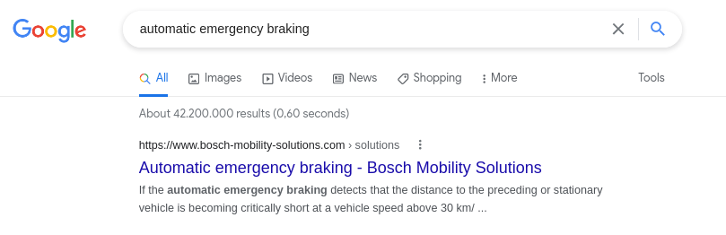
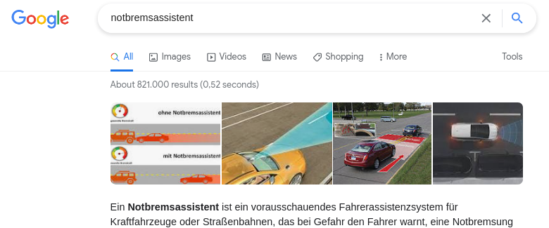
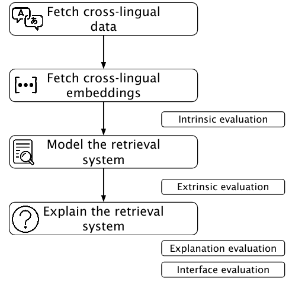

Have you ever searched for *notbremsassistent* in a regular search engine and felt you still missed out search results just because you searched in German? Wouldn't you expect better and relevant results in other languages, as well? 

To motivate further, check what Google gives as search results for the same query (though in different languages). Do note the number of search results and the language of results retrieved. 

:-------------------------:|:-------------------------:
 |  
:-------------------------:|:-------------------------:

Does such a language-restricted search do justice to your comprehensive information need?

## Why do I need a CLTR system?

Cross-lingual Text retrieval system (or, CLTR) system retrieves results transcending the boundary of language. Don't you think this is what we need in this age of booming information where Internet should not be *just as big as the language you speak*. Read more about the digital language divide [here](http://labs.theguardian.com/digital-language-divide/). 

## Why do I need an Explainable system?

How many times have you wondered why you are presented a search result when you searched for a particular query? Was it because of the similarity in the topic, common words or something more abstract? As y user, you are entitled with the *right to obtain an explanation made by an automated decision maker*. Read more about Recital 71 from EU GDPR [here](https://www.privacy-regulation.eu/en/recital-71-GDPR.htm).

This brings us down to the topic of this thesis- an Explainable Cross-Lingual Text Retrieval on Automotive domain.

## Let's talk about the thesis..

### Goal

- Aims at developing an explainable CLTR with a combination of model-agnostic and corpus-exploratiry methods.
- Evisages a transition from generic keyword based search to domain-specific semantic search aided by dense (static - word2vec, fastText and contextual - Sentence-BERT, mBERT) text representaions.

### Plan 

  

### Phase 1 Evaluation

This phase intends to evaluate the following.
- How good are the explanations the system present in comparison with the human judgement?
- Are the results better when a static embedding model is used or a contextual model is used?
